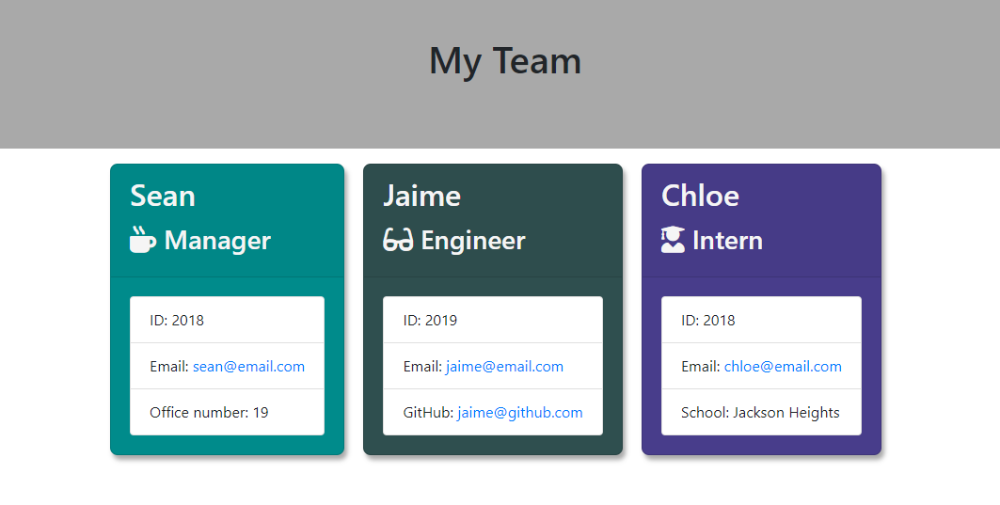
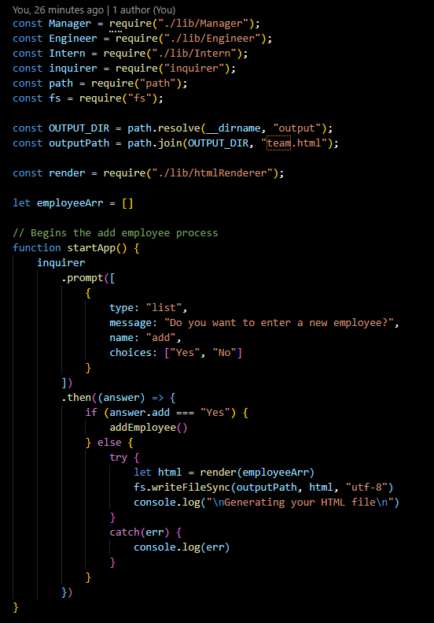
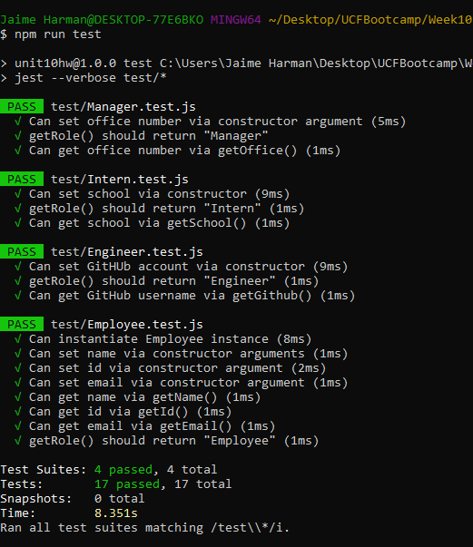

# Template-Engine

# Description
This application will build a software engineering team generator command line application. The application will prompt the user for information about the team manager and then information about the team members. The user can input any number of team members, and they may be a mix of engineers and interns. When the user has completed building the team, the application will create an HTML file that displays a nicely formatted team roster based on the information provided by the user.

# Installation
You will need to run npm install from inside the folder with package.json

# Example of Code

# Usage
You will install the dependencies, then run via node app.js; Once prompted, you will input information. You can continue to add new employees by selecting "yes" or you may select "no" to exit. This will generate the team.html profile;

[Watch this Demo Video](https://drive.google.com/file/d/1vZknkMFqJNkGJIl0rraMMgba3My9JVgH/view?usp=sharing)

# Tests
You can npm run test to check the validity of the classes used for the team: Employee and then, Manager, Egineer, and Intern that inherit the Employee class.

# Questions
Please contact me at jaimeharman17@gmail.com

